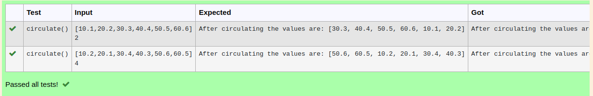

# Circulate-the-values-of-N-variables
## Aim:
To write a python program to circulate the n variables using function concept
## Equipment’s required:
PC
Anaconda - Python 3.7
## Algorithm: 
### Step 1: 
Get the value form the user for rotation.
### Step 2: 
Get the value from the user for the number of rotation
### Step 3: 
Using the slicing concept rotate the list.
 
## Program:
```
circulate the values of n variables
developed by: dhivyapriya. r
register no.: 22008389
```
a=eval(input())

b=int(input())

def circulate():
    
    for n in range(b+1):    

        c=a[n:]+a[:n]

    return c

print("After circulating the values are:",circulate())

## Output:



## Result:
Thus the python program to circulate the n variables was successfully executed
